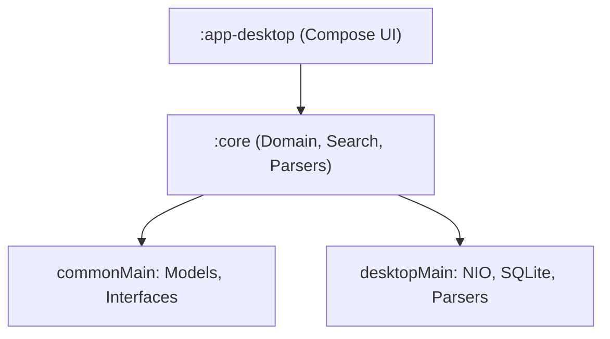

# Codeoba — Cross-Tool AI Chat Search

Codeoba is a platform-agnostic, zero-dependency, 100% local search application that aggregates and indexes conversation transcripts from major AI coding assistants into a unified desktop dashboard.

---

## 🚀 Key Features

*   **Multi-Agent Indexing**: Automatically parses and models conversation transcripts from:
    *   **Claude Code** (`~/.claude/projects/` JSONL logs)
    *   **Google Antigravity** (`~/.gemini/antigravity/brain/` transcripts)
    *   **Cursor** (`state.vscdb` global/workspace SQLite states)
    *   **OpenAI Codex** (`~/.codex/` JSONL sessions)
    *   **Aider** (`.aider.chat.history.md` markdown workspace logs)
*   **Dual Search Engines**: Keyword search (lexical) + concept-matching local vector search (semantic).
*   **Live Incremental Watchers**: Real-time thread index updates via background directory watchers.
*   **Startup Caching & Profiling**: Persistently caches parsed conversation models locally (`~/.codeoba/cache/`) to speed up subsequent app launches, complete with a structured startup execution time profiler. Can be configured via the settings panel or overridden using CLI flags (`--cache` / `--no-cache`).
*   **Sleek Multi-Pane UI**: Obsidian-dark theme with syntax highlighting, history navigation, and quick clipboard actions.

---

## 🏗️ Project Architecture

*   **`:core`**: Holds the unified models ([Session.kt](./core/src/commonMain/kotlin/llc/lookatwhataicando/codeoba/core/domain/model/Session.kt), [Turn.kt](./core/src/commonMain/kotlin/llc/lookatwhataicando/codeoba/core/domain/model/Turn.kt)), parsing adapters, search engines, and directory watchers.
*   **`:app-desktop`**: Jetpack Compose Multiplatform entry point and modular UI layouts ([Main.kt and UI components](./app-desktop/src/desktopMain/kotlin/llc/lookatwhataicando/codeoba/desktop/)).

---

## 🛠️ Build & Run Commands

- **Compile**: `./gradlew :app-desktop:compileKotlinDesktop`
- **Test**: `./gradlew :core:desktopTest`
- **Launch Application**: `./gradlew :app-desktop:run`

---

## 🔒 Privacy & Local-First Philosophy

*   100% local-first: no remote accounts, telemetry, trackers, or cloud storage syncing.
*   All parser steps, SQL queries, and semantic embeddings are executed directly on your local machine.
