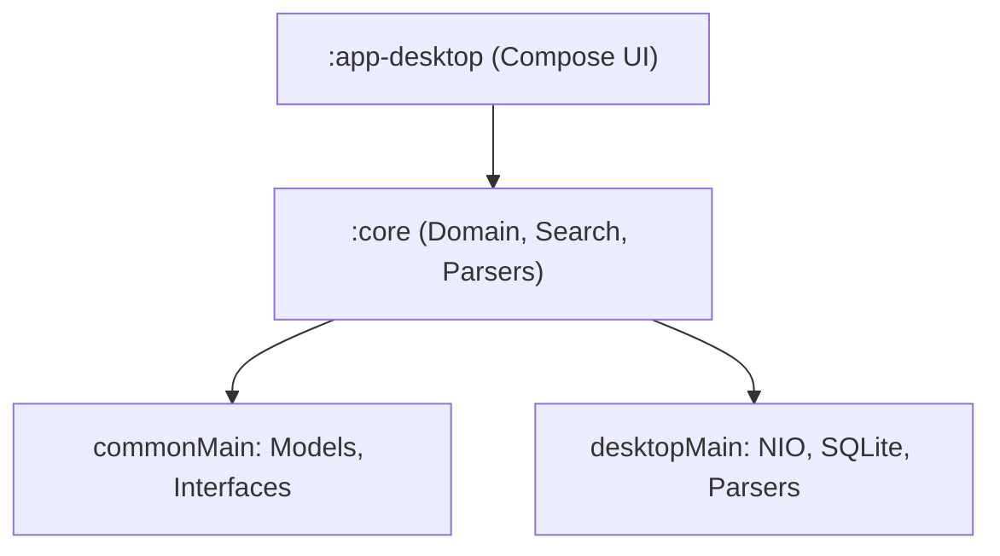

# Codeoba — Cross-Tool AI Chat Search

Codeoba is a platform-agnostic, zero-dependency, 100% local search application that aggregates and indexes conversation transcripts from major AI coding assistants into a unified desktop dashboard.

---

## 🚀 Key Features

*   **Multi-Agent Indexing**: Automatically parses and models conversation transcripts from:
    *   **Claude Code** (`~/.claude/projects/` JSONL logs)
    *   **Google Antigravity** (`~/.gemini/antigravity/brain/` transcripts)
    *   **Cursor** (`state.vscdb` global/workspace SQLite states)
    *   **OpenAI Codex** (`~/.codex/` JSONL sessions)
    *   **Aider** (`.aider.chat.history.md` markdown workspace logs)
    *   **GitHub Copilot** (`~/.copilot/session-state/` JSONL events)
*   **Dual Search Engines**: Keyword search (lexical) + concept-matching local vector search (semantic).
*   **Live Incremental Watchers**: Real-time thread index updates via background directory watchers.
*   **Startup Caching & Profiling**: Persistently caches parsed conversation models locally (`~/.codeoba/cache/`) to speed up subsequent app launches, complete with a structured startup execution time profiler. Can be configured via the settings panel or overridden using CLI flags (`--cache` / `--no-cache`).
*   **Sleek Multi-Pane UI**: Choice of 8 handsome dark color themes (including Obsidian, Nordic Frost, Dracula, and Emerald Forest) with syntax highlighting, history navigation, and quick clipboard actions.
*   **Secure In-App File Viewer**: Safely resolves local links within chats using a secure, symlink-aware path resolver. Automatically prompts for user consent on paths outside the active session workspace (`cwd`) and stores action-specific choices (previewing vs. external opening) securely. Integrates a 5MB memory-bounded reader to prevent resource exhaustion.
*   **Auto-Updates**: Automatically checks for releases on startup (configurable) or manually via settings, downloading and running native platform installers (`.pkg`, `.msi`, `.deb`) directly to preserve security signatures and Gatekeeper validation.

---

## 🔍 How Search Works (Lexical vs. Semantic)

Codeoba provides two distinct search modes to locate information in your coding assistant logs:

1. **Lexical Search (Keyword / Substring Find)**
   * **Best For:** Finding exact character matches, specific variable/function names, code snippets, tags, or TODO comments (e.g., `onCloseRequest`, `TODO:`, `git merge`).
   * **How it works:** Performs literal case-insensitive or case-sensitive character-sequence matching across all sessions and turns.
   
2. **Semantic Search (Conceptual / Natural Language)**
   * **Best For:** Natural language queries, questions, or conceptual searches (e.g., `how to deploy to mobile store`, `setting up database transaction locks`).
   * **How it works:** Utilizes a lightweight, quantized `all-MiniLM-L6-v2` transformer model (~23 MB, downloaded automatically to `~/.codeoba/models/` on first toggle) to convert text turns into 384-dimensional conceptual vectors. It finds matches using cosine similarity.
   * **Key Details:**
     * **Model Context Window:** The model accepts up to 256 tokens. Dialogue turns longer than this are truncated for semantic vector comparison.
     * **Embedding Cache:** Embedding calculations are CPU-intensive. The first indexing run can take 15–30 seconds for large log folders. Codeoba caches these vectors locally at `~/.codeoba/cache/embeddings_cache.json` so that subsequent searches and app launches load in milliseconds.
     * **Adjustable Threshold:** You can configure search strictness under the **Settings -> Semantic** panel using the Similarity Threshold slider. Lower values return more fuzzy results, while higher values require stricter matching. A **Restore to Default** button is available to reset it to `0.30` at any time.

---

## 🏗️ Project Architecture



*   **`:core`**: Holds the unified models ([Session.kt](./core/src/commonMain/kotlin/com/whataicando/codeoba/core/domain/model/Session.kt), [Turn.kt](./core/src/commonMain/kotlin/com/whataicando/codeoba/core/domain/model/Turn.kt)), parsing adapters, search engines, and directory watchers.
*   **`:app-desktop`**: Jetpack Compose Multiplatform entry point and modular UI layouts ([Main.kt and UI components](./app-desktop/src/desktopMain/kotlin/com/whataicando/codeoba/desktop/)).

---

## 🛠️ Build & Run Commands

- **Compile**: `./gradlew :app-desktop:compileKotlinDesktop`
- **Test**: `./gradlew :core:desktopTest`
- **Launch Application**: `./gradlew :app-desktop:run`

### ⚙️ Developer Runtime Modes & Configuration

By default, the application runs in **Free/Local-First Mode** (zero cloud dependencies, subscription features compiled out). For developers working on subscription, syncing, or remote-control features, the app supports three environments:

#### 1. Free/Local-First Mode (Default)
Runs 100% locally on your machine with no external credentials, internet, or databases required.
* **Compile-Time Setup**: No properties file or key configuration is needed.
* **Run**: 
  ```bash
  ./gradlew :app-desktop:run
  ```

#### 2. Local Emulator Development Mode
Enables paid subscription and multi-device sync UI features locally by connecting to a local offline Firebase Emulator Suite.
* **Compile-Time Setup**: 
  Create `local.properties` in the root folder of this repository (it is git-ignored by default) and add:
  ```properties
  # Enable subscription and sync features in the UI
  # (Note: This is a temporary developer toggle to A/B test the client with/without subscription
  # features. Upon subscription release, this option will be removed and permanently enabled).
  codeoba.enable_subscription=true
  
  # The native OS keyring is automatically bypassed by default in local/staging environments
  # to prevent repeated keychain authorization prompts when unsigned developer builds are run.
  ```
  *(Note: When pointing to the local emulator, the client defaults to `EMULATOR_ONLY` for the Firebase API key. However, because subscription features are enabled, you must configure a public verification key (`codeoba.premium.public_key=...`) in `local.properties` to verify the premium module signature. Developers with access to the premium module can generate and pair these key properties automatically using the developer key setup tasks).*
* **Run**: Start the app by passing the local emulator base URL as a JVM System Property:
  ```bash
  ./gradlew :app-desktop:run -Dcodeoba.base_url=localhost:5000
  ```

#### 3. Deployed Dev Server Mode (Staging sandbox pointing to dev.codeoba.com)
Connects the local client app directly to the public staging cloud backend (Firebase project `codeoba-dev`).
* **Compile-Time Setup**:
  Add the following compile-time variables to `local.properties` (or set them as environment variables in your build shell):
  ```properties
  codeoba.enable_subscription=true
  
  # Paste your staging Firebase Web API Key:
  codeoba.firebase.api_key=YOUR_STAGING_FIREBASE_WEB_API_KEY
  
  # Paste your staging Public Key (pairs with premium private key):
  codeoba.premium.public_key=YOUR_STAGING_PREMIUM_PUBLIC_KEY
  
  # Paste your staging app signature attestation token:
  codeoba.app_signature_hash=YOUR_STAGING_APP_SIGNATURE_TOKEN
  ```
  *(If using environment variables, export them in your terminal before building: `CODEOBA_FIREBASE_API_KEY`, `CODEOBA_PREMIUM_PUBLIC_KEY`, and `CODEOBA_APP_SIGNATURE_HASH`).*
* **Run**: Run the client pointing to the staging base URL:
  ```bash
  ./gradlew :app-desktop:run -Dcodeoba.base_url=dev.codeoba.com
  ```

#### 4. Deployed Production Mode (Pointing to codeoba.com)
Connects the client app to the live production database and backend services.
* **Compile-Time Setup**:
  Add the production variables to `local.properties` (or export as environment variables):
  ```properties
  codeoba.enable_subscription=true
  codeoba.firebase.api_key=YOUR_PRODUCTION_FIREBASE_WEB_API_KEY
  codeoba.premium.public_key=YOUR_PRODUCTION_PREMIUM_PUBLIC_KEY
  codeoba.app_signature_hash=YOUR_PRODUCTION_APP_SIGNATURE_TOKEN
  ```
* **Run**: Run the client pointing to the production base URL:
  ```bash
  ./gradlew :app-desktop:run -Dcodeoba.base_url=codeoba.com
  ```

---

## 🔒 Privacy & Local-First Philosophy

*   100% local-first: no remote accounts, telemetry, trackers, or cloud storage syncing.
*   All parser steps, SQL queries, and semantic embeddings are executed directly on your local machine.
