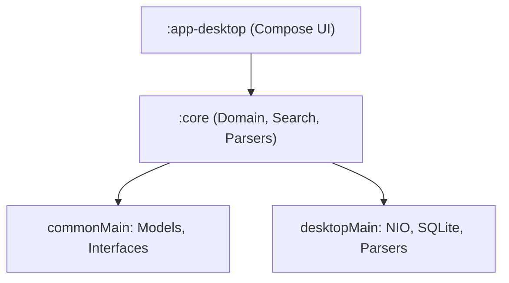

# Codeoba — Cross-Tool AI Chat Search

Codeoba is a platform-agnostic, zero-dependency, 100% local search application that aggregates and indexes conversation transcripts from major AI coding assistants into a unified desktop dashboard.

---

## 🚀 Key Features

*   **Multi-Agent Indexing**: Automatically parses and models conversation transcripts from:
    *   **Claude Code** (`~/.claude/projects/` JSONL logs)
    *   **Google Antigravity** (`~/.gemini/antigravity/brain/` transcripts)
    *   **Cursor** (`state.vscdb` global/workspace SQLite states)
    *   **OpenAI Codex** (`~/.codex/` JSONL sessions)
    *   **Aider** (`.aider.chat.history.md` markdown workspace logs)
    *   **GitHub Copilot** (`~/.copilot/session-state/` JSONL events)
*   **Dual Search Engines**: Keyword search (lexical) + concept-matching local vector search (semantic).
*   **Live Incremental Watchers**: Real-time thread index updates via background directory watchers.
*   **Startup Caching & Profiling**: Persistently caches parsed conversation models locally (`~/.codeoba/cache/`) to speed up subsequent app launches, complete with a structured startup execution time profiler. Can be configured via the settings panel or overridden using CLI flags (`--cache` / `--no-cache`).
*   **Sleek Multi-Pane UI**: Choice of 8 handsome dark color themes (including Obsidian, Nordic Frost, Dracula, and Emerald Forest) with syntax highlighting, history navigation, and quick clipboard actions.
*   **Secure In-App File Viewer**: Safely resolves local links within chats using a secure, symlink-aware path resolver. Automatically prompts for user consent on paths outside the active session workspace (`cwd`) and stores action-specific choices (previewing vs. external opening) securely. Integrates a 5MB memory-bounded reader to prevent resource exhaustion.
*   **Auto-Updates**: Automatically checks for releases on startup (configurable) or manually via settings, downloading and running native platform installers (`.pkg`, `.msi`, `.deb`) directly to preserve security signatures and Gatekeeper validation.

---

## 🔍 How Search Works (Lexical vs. Semantic)

Codeoba provides two distinct search modes to locate information in your coding assistant logs:

1. **Lexical Search (Keyword / Substring Find)**
   * **Best For:** Finding exact character matches, specific variable/function names, code snippets, tags, or TODO comments (e.g., `onCloseRequest`, `TODO:`, `git merge`).
   * **How it works:** Performs literal case-insensitive or case-sensitive character-sequence matching across all sessions and turns.
   
2. **Semantic Search (Conceptual / Natural Language)**
   * **Best For:** Natural language queries, questions, or conceptual searches (e.g., `how to deploy to mobile store`, `setting up database transaction locks`).
   * **How it works:** Utilizes a lightweight, quantized `all-MiniLM-L6-v2` transformer model (~23 MB, downloaded automatically to `~/.codeoba/models/` on first toggle) to convert text turns into 384-dimensional conceptual vectors. It finds matches using cosine similarity.
   * **Key Details:**
     * **Model Context Window:** The model accepts up to 256 tokens. Dialogue turns longer than this are truncated for semantic vector comparison.
     * **Embedding Cache:** Embedding calculations are CPU-intensive. The first indexing run can take 15–30 seconds for large log folders. Codeoba caches these vectors locally at `~/.codeoba/cache/embeddings_cache.json` so that subsequent searches and app launches load in milliseconds.
     * **Adjustable Threshold:** You can configure search strictness under the **Settings -> Semantic** panel using the Similarity Threshold slider. Lower values return more fuzzy results, while higher values require stricter matching. A **Restore to Default** button is available to reset it to `0.30` at any time.

---

## 🏗️ Project Architecture

*   **`:core`**: Holds the unified models ([Session.kt](./core/src/commonMain/kotlin/llc/lookatwhataicando/codeoba/core/domain/model/Session.kt), [Turn.kt](./core/src/commonMain/kotlin/llc/lookatwhataicando/codeoba/core/domain/model/Turn.kt)), parsing adapters, search engines, and directory watchers.
*   **`:app-desktop`**: Jetpack Compose Multiplatform entry point and modular UI layouts ([Main.kt and UI components](./app-desktop/src/desktopMain/kotlin/llc/lookatwhataicando/codeoba/desktop/)).

---

## 🛠️ Build & Run Commands

- **Compile**: `./gradlew :app-desktop:compileKotlinDesktop`
- **Test**: `./gradlew :core:desktopTest`
- **Launch Application**: `./gradlew :app-desktop:run`

---

## 🔒 Privacy & Local-First Philosophy

*   100% local-first: no remote accounts, telemetry, trackers, or cloud storage syncing.
*   All parser steps, SQL queries, and semantic embeddings are executed directly on your local machine.
