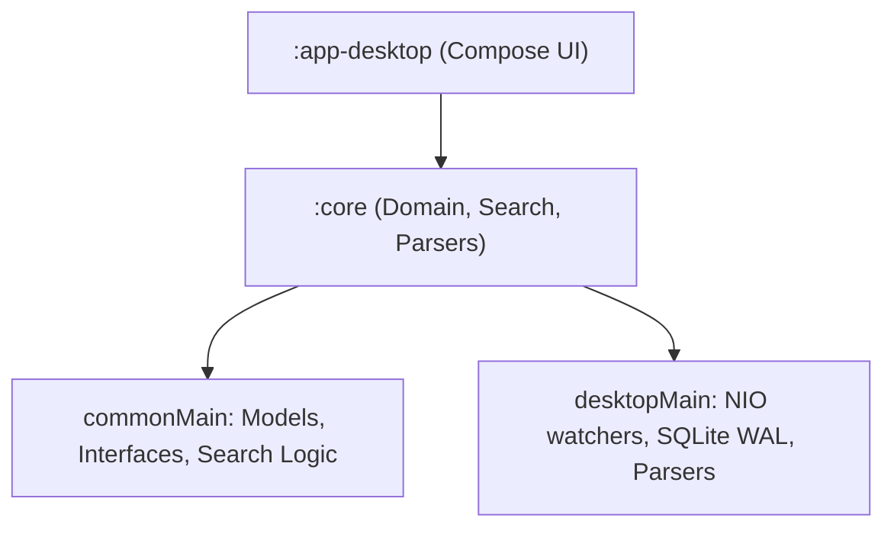

# Architecture Guide — Codeoba

Platform-agnostic, zero-dependency local indexing & search engine for AI coding logs (Claude Code, Antigravity, Cursor, Codex, Aider, GitHub Copilot).

---

## 🏗️ Module Structure



### 1. `:core`
- **`commonMain`**: Contains models (`Session`, `Turn`), search engine interfaces, shared `SemVer.kt` version parsing, and lexical/semantic search algorithms.
- **`desktopMain`**: JVM SQLite JDBC adapter, NIO `WatchService` directory monitoring, ONNX runtime embeddings execution, and local file permission manager.

### 2. `:app-desktop`
Jetpack Compose presentation layer split into:
- `Main.kt` (State coordinator & background detection polling), `Sidebar.kt` (Search filter, sorting, and context menus), `DetailPane.kt` (Thread viewer & collapsible work blocks), `Components.kt` (Overlay dialogs & drag-to-scroll extensions), `FormatUtils.kt` (Formatting & Clipboard), `MarkdownParser.kt` (Highlighting & Link resolution), `SettingsDialog.kt` (Preferences & Permissions UI), `StatsComponents.kt` (Metrics charts), `UpdateManager.kt` (Update manager), and `UpdateDialog.kt` (Update prompt UI).

---

## 📊 Standardized Data Model

Defined in `commonMain`:

```kotlin
data class Session(
    val id: String,
    val sourceId: String, // "claude", "cursor", "antigravity", "aider", "codex", "copilot"
    val filePath: String,
    val timestamp: Long,
    val updatedAt: Long,
    val cwd: String?,
    val threadName: String?,
    val turns: List<Turn>,
    val isArchived: Boolean = false,
    val isPinned: Boolean = false
)

data class Turn(
    val turnId: String,
    val userMessage: String,
    val assistantMessage: String,
    val timestamp: Long = 0L,
    val extraData: Map<String, String> = emptyMap() // e.g. "model", "computeTimeMs", "isCompaction", "compactionTimeMs"
)
```

---

## 🔌 Source Adapters

Adapters implement the `SourceAdapter` interface to parse transcripts:

```kotlin
interface SourceAdapter {
    val id: String
    val displayName: String
    fun isAvailable(): Boolean
    fun getDefaultLogPaths(): List<String>
    fun getWatchPaths(): List<String>
    fun getWatchFileFilter(): ((String) -> Boolean)? = null
    suspend fun parseSession(filePath: String): Session?
    suspend fun parseAllSessions(): List<Session>
    fun isAppInstalled(): Boolean = true
    fun deleteDataPaths(): Boolean = false
    fun getDataPathsToDelete(): List<String> = emptyList()
}
```

### Implementations:
All desktop source implementations inherit from the abstract base class [DesktopSourceAdapter](../core/src/desktopMain/kotlin/llc/lookatwhataicando/codeoba/core/source/DesktopSourceAdapter.kt) under `desktopMain`, which centralizes common caching, folder validation (`getBaseDir()`), directory deletion, and command execution availability checking.

1. **`DesktopCursorSource`**: Parses Cursor's global SQLite (`state.vscdb`). Filters sessions against each workspace's local `allComposers` list to exclude deleted sessions. Overrides the base `parseSession` to handle row-level database hashing.
2. **`DesktopClaudeSource`**: Parses JSONL log files under `~/.claude/projects/`. Implements `parseSessionContent(File)`.
3. **`DesktopAntigravitySource`**: Parses Antigravity's JSONL files, extracting settings changes (e.g., `<USER_SETTINGS_CHANGE>`), system messages (e.g., background compile logs), and tool execution error logs. Implements `parseSessionContent(File)`. Also parses archived status from companion annotation `.pbtxt` files.
4. **`DesktopCodexSource`**: Indexes JSONL logs under `~/.codex/`. Implements `parseSessionContent(File)` and loads session titles from a central index mapping file.
5. **`DesktopAiderSource`**: Reads and tokenizes Markdown logs (`.aider.chat.history.md`). Implements `parseSessionContent(File)`.
6. **`DesktopCopilotSource`**: Parses GitHub Copilot sessions stored under `~/.copilot/session-state/`. Parses session metadata from `workspace.yaml` and chronologically groups conversation turns and tool execution outputs from `events.jsonl`.

---

## 🔍 Search, Indexing & Performance Patterns

- **`LexicalSearchEngine`**: Keyword query match using term frequency ranking.
- **`SemanticSearchEngine`**: Concept similarity ranking using local ONNX-based transformer embeddings (`all-MiniLM-L6-v2`) and cosine distance.
  - Pre-trained models are downloaded on demand to `~/.codeoba/models/` and run locally via ONNX Runtime JVM bindings.
  - Similarity threshold is dynamically adjustable via settings slider.
  - Text embeddings are persistently cached in `~/.codeoba/cache/embeddings_cache.json` using `EmbeddingCacheManager`.
  - Parallel indexing runs with `Semaphore(4)` to prevent blocking the UI thread.
- **`SearchFilter`**: Restricts search results by source IDs, timestamp ranges, workspace paths, and active vs archived status (Active/Archived chips).
- **`IndexManager`**: Coordinates scanning, index updates, directory watchers, and timing instrumentation.
- **`SessionCacheManager`**: Persistently caches pre-parsed `Session` models under `~/.codeoba/cache/cache_<sourceId>.json` using `kotlinx.serialization` to avoid expensive startup JSON/Markdown parsing and semantic embedding computation:
  - File-based sources: Check file metadata (path, size, modification timestamp) to hit cache instantly. When AI summarization is enabled, checking the cache first ensures that hits completely bypass local model inference by returning the fully cached and summarized session.
  - Database-based sources (Cursor): Compute string MD5 hashes on SQLite values in memory to hit cache without JSON parsing.
  - Pruning: Automatically deletes orphaned cache entries for sessions that are no longer present on disk during scans.
- **`Startup Profiler`**: Measures and formats log reports of exact scanning times and percentages for all registered active source adapters. Together with the persistent caching layer, this reduces the average startup log scanning/load time from ~2.5s down to ~0.25s (a ~90% optimization).
- **SQLite WAL**: Uses `mode=ro` (read-only) without `immutable` to safely query Cursor’s database concurrently in real time.
- **Targeted Watcher Filters**: Directory watchers filter events (e.g. only `.jsonl` or `.aider.chat.history.md` files) to prevent recursive build loops.
- **Context Compaction Tracking**: Identifies compaction checkpoints (`"type":"CHECKPOINT"`) in Google Antigravity logs, computes duration relative to preceding user inputs, persists it under `Turn.extraData` (`isCompaction`, `compactionTimeMs`), and highlights them in session badges and main stats.
- **Conversation Pinning**: Allows users to pin sessions. Pin status is stored in Settings and stable-sorted to float pinned sessions to the top of the sidebar list view while maintaining secondary sorting criteria.
- **Conversations Sidebar List Sorting**: Interactive chips on the left sidebar sort sessions dynamically by Updated, Tokens, Speed, Turns, Duration, and Relevance. Numeric/temporal metrics default to descending, lexical/metadata ascending. Active chip toggles direction. Falls back from Relevance to Updated on empty search query.

---

## 🎨 UI Style Guidelines & Core Presentation Patterns

1. **Dynamic Color Theme Styling Palette**: 8 built-in themes (Obsidian, Nordic Frost, Emerald Forest, Sunset Copper, Royal Amethyst, Dracula, Cyberpunk Neon, Monochrome Slate) loaded dynamically from settings into `ThemeManager.currentTheme` which provides HSL-harmonious color assets (`AccentCyan`, `ObsidianBg`, `CardSurface`, `BorderColor`, `TextPrimary`, `TextSecondary`).
2. **Mixed-Case Casing Constraint**: Labels utilize capitalized words (e.g. "User", "Assistant") instead of uppercase-only strings.
3. **macOS Titlebar Alignment**: Sets a `76.dp` spacer to avoid macOS system window control overlaps.
4. **Navigation History Stack & Breadcrumbs Toolbar**: Maintained in `Main.kt` via navigation history indices, allowing back/forward breadcrumb controls. Breadcrumbs display `Workspace Name / Active Session Title`. Clickable workspace root clears selection. Far-right actions (`...`) dropdown provides copy actions and local file opening.
5. **Text Vertical Alignment Offset**: Applies proactive compensation (`Modifier.offset(y = 1.dp)`) in centering containers for heights `< 32.dp`. For small texts nested inside an `OutlinedTextField` trailing icon, breaks parent text style inheritance by passing `style = TextStyle.Default` and setting `lineHeight = fontSize`.
6. **Scrollbar Controls**: Touch and drag mouse-scroll triggers scrollbars styled via `themedScrollbarStyle()` using the `.dragToScroll()` extension. Adds small padding (e.g. `end = 12.dp`) on scrollable containers to prevent overlap.
7. **Multi-Level Expandable Details**: Group assistant message parts up to the last tool execution of a turn into a top-level collapsible `WorkedForBlock` Composable, rendering as a clickable header (Level 1) that expands nested tool headers (Level 2) and raw tool outputs (Level 3) with a left connector thread line (50% opacity border color). Auto-expands the work block via `LaunchedEffect` if search matches inside.
8. **Tool Tag Escaping Parser**: Antigravity/Copilot parsing escapes `[[[TOOL:` and `[[[/TOOL]]]` tags during extraction to prevent malformed UI render blocks. The UI's `parseAssistantMessage` skips escaped tags and unescapes them back to their original form for presentation.
9. **Sidebar Session Item Tag Display**: Assigned groups are shown as a `FlowRow` of badges styled in `AccentPurple` (12% alpha background, 40% alpha border, 4.dp rounded corners) below the last message snippet, with badge text offset by `0.5.dp`.
10. **Entire Sidebar Cell Draggable Hit-Testing**: Placing `.clickable` modifier *before* (outer to) `.pointerInput` modifiers in the chain ensures the entire cell shape is hit-testable. Custom `.pointerHoverIcon` is placed *after* `.clickable` to avoid intercepting long-press events. Uses immediate `detectDragGestures` instead of `detectDragGesturesAfterLongPress` to prevent vertical drag conflicts with list scrolling.
11. **Markdown Link Resolution & In-App File Viewer**:
    - Underlines and highlights links in `AccentCyan`.
    - Handles tap/hover character boundaries in `ClickableMarkdownText` to avoid false clicks on blank spaces.
    - Resolves local files via `LocalFileResolver.resolveLocalFileLink`.
    - Implements strict boundary checking. Files outside the workspace directory (`session.cwd`) trigger `ConfirmationRequired`.
    - Persists consent choices (`ALLOW` / `DENY`) in Preferences split by action scopes (`PREVIEW` vs `EXTERNAL_OPEN`) using `PermissionManager`.
    - Loads a maximum of 5MB + 1 byte for in-app text preview or recursive markdown rendering.
12. **FlowRow Statistic Wrapping**: Wrap conversation stats inside a `FlowRow` to prevent vertical layout clipping on the dashboard.
13. **Model Performance & Usage Breakdown Sorting**: Renders stats per model on the main dashboard. Allows sorting by Turns, Tokens, Speed, Duration, and Model Name via interactive sorting chips wrapped in a `FlowRow`. Active sort selection is indicated by an arrow icon.
14. **Session Item Context Menu & Toast Notification**: Right-clicking a session item in the sidebar list view opens a custom `DropdownMenu` at the click cursor location. Provides options to toggle pin status, edit groups/tags, open the session file, and copy session ID or file path (which triggers a bottom-aligned floating toast notification overlay with cyan accents (`AccentCyan`) using `AnimatedVisibility`).

---

## ⚙️ Settings Management, OS Portability & Auto-Updates

Persisted via `java.util.prefs.Preferences` (or OS-native credential store for sensitive items):
- **Credentials & Keys**: Stored in the OS credential store (Keychain, Credential Manager, Secret Service) via `SecureStorage` / `java-keyring` when available, with a `java.util.prefs.Preferences` fallback. Can be bypassed via the `-Dcodeoba.no.keyring=true` JVM property.
- **States**: `Monitor` (scan even if not installed), `Ignore` (skip folder), `Default` (prompt on orphaned logs).
- **Settings UI**: Two-pane dialog in `:app-desktop` for settings toggles and recursive path purges.
- **Search Filters**: Restores the last selected "Filter by Source" and "Filter by Status" states on application launch.
- **Auto-Updates**: Configures automatic startup update checks (enabled/disabled) and stores user-skipped version tags, providing manual check hooks and native platform installer deployment.

- **Preferences Persistence**: Persisted via `java.util.prefs.Preferences` including sidebar width, window bounds, maximized state, active screen, search filters, and similarity thresholds. Window coordinates are validated against the active display configuration (`GraphicsEnvironment`) on startup to prevent off-screen layouts.
- **Exhaustive Settings List**: Displays all supported adapters. The sources list is sorted alphabetically by their display name, but bisected into two groups: installed adapters are displayed at the top, followed by uninstalled/not-detected adapters at the bottom.
- **Dynamic soft-disabling & Background Polling**: Soft-disables undetected adapters. A background loop checks adapter availability every 5 seconds, triggering an automatic full index scan if states change.
- **Consolidated OS Detection**: Avoids direct system property checks. Uses centralized helpers in `PlatformUtils` (`PlatformUtils.isMac()`, `PlatformUtils.isWindows()`, `PlatformUtils.isLinux()`).
- **Auto-Updates**:
  - Exposes the app version at runtime by generating a `version.txt` resource via a custom Gradle build task during compilation.
  - Compares versions using the shared `SemVer` class (parsing major, minor, patch fields).
  - Queries Firebase Cloud Function endpoints on startup using a customized User-Agent containing telemetry fields (OS, arch, anonymized GUID).
  - Downloads `.msi`, `.pkg`, or `.deb` packages to `~/.codeoba/updates/` with visual progress tracking.
  - Launches native installers (e.g. passive MSI `/passive` on Windows) via `ProcessBuilder` and exits JVM clean.
