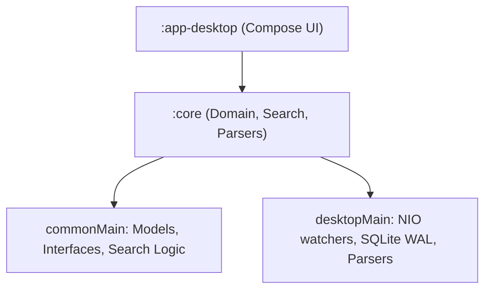

# Architecture Guide — Codeoba

Platform-agnostic, zero-dependency local indexing & search engine for AI coding logs (Claude Code, Antigravity, Cursor, Codex, Aider).

---

## 🏗️ Module Structure



### 1. `:core`
- **`commonMain`**: Contains models (`Session`, `Turn`), search engine interfaces, and lexical/semantic search algorithms.
- **`desktopMain`**: JVM SQLite JDBC adapter and NIO `WatchService` directory monitoring.

### 2. `:app-desktop`
Jetpack Compose presentation layer split into:
- `Main.kt` (State coordinator), `Sidebar.kt` (Search filter lists), `DetailPane.kt` (Thread viewer), `Components.kt` (Overlay dialogs), `FormatUtils.kt` (Formatting & Clipboard), `MarkdownParser.kt` (Highlighting), `SettingsDialog.kt` (Preferences UI), and `StatsComponents.kt` (Metrics charts).

---

## 📊 Standardized Data Model

Defined in `commonMain`:

```kotlin
data class Session(
    val id: String,
    val sourceId: String, // "claude", "cursor", "antigravity", "aider", "codex"
    val filePath: String,
    val timestamp: Long,
    val updatedAt: Long,
    val cwd: String?,
    val threadName: String?,
    val turns: List<Turn>,
    val isArchived: Boolean
)

data class Turn(
    val turnId: String,
    val userMessage: String,
    val assistantMessage: String,
    val timestamp: Long,
    val extraData: Map<String, String> // e.g. "model", "computeTimeMs"
)
```

---

## 🔌 Source Adapters

Adapters implement the `SourceAdapter` interface to parse transcripts:

```kotlin
interface SourceAdapter {
    val id: String
    val displayName: String
    fun isAvailable(): Boolean
    fun getDefaultLogPaths(): List<String>
    fun getWatchPaths(): List<String>
    fun getWatchFileFilter(): (String) -> Boolean = { true }
    suspend fun parseSession(filePath: String): Session?
    suspend fun parseAllSessions(): List<Session>
}
```

### Implementations:
1. **`DesktopCursorSource`**: Parses Cursor's global SQLite (`state.vscdb`). Filters sessions against each workspace's local `allComposers` list to exclude deleted sessions.
2. **`DesktopClaudeSource`**: Parses JSONL log files under `~/.claude/projects/`.
3. **`DesktopAntigravitySource`**: Parses Antigravity's JSONL files, extracting settings changes (e.g., `<USER_SETTINGS_CHANGE>`), system messages (e.g., background compile logs), and tool execution error logs.
4. **`DesktopCodexSource`**: Indexes JSONL logs under `~/.codex/`.
5. **`DesktopAiderSource`**: Reads and tokenizes Markdown logs (`.aider.chat.history.md`).

---

## 🔍 Search & Indexing

- **`LexicalSearchEngine`**: Keyword query match using term frequency ranking.
- **`SemanticSearchEngine`**: Concept similarity ranking using local hashing-based embeddings and cosine distance.
- **`SearchFilter`**: Restricts search results by source IDs, timestamp ranges, workspace paths, and session archival status (`ArchivalFilter`).
- **`IndexManager`**: In-memory thread-safe cache updating in `<5ms` via background NIO folder watchers.
- **SQLite WAL**: Uses `mode=ro` (read-only) without `immutable` to safely query Cursor’s database concurrently in real time.

---

## ⚙️ Settings Management

Persisted via `java.util.prefs.Preferences`:
- **States**: `Monitor` (scan even if not installed), `Ignore` (skip folder), `Default` (prompt on orphaned logs).
- **Settings UI**: Two-pane dialog in `:app-desktop` for settings toggles and recursive path purges.
- **Search Filters**: Restores the last selected "Filter by Source" and "Filter by Status" states on application launch.
