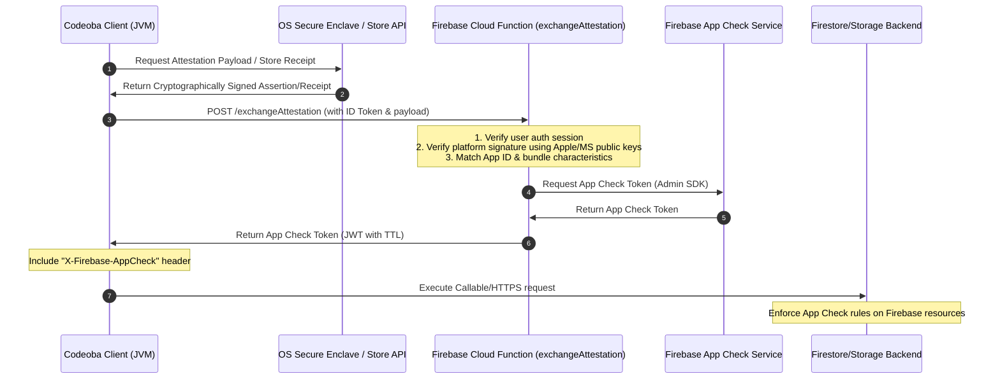

# Codeoba App Signing & Firebase App Check Attestation Plan

This document details the roadmap and implementation design for configuring Developer Accounts, code signing, package distribution, and cryptographic client attestation (Firebase App Check) across macOS, Windows, and Linux.

---

## 🏗️ Architectural Overview & The JVM Desktop Constraint

Because **Codeoba** is a Kotlin Multiplatform (KMP) desktop application running on the JVM, it does not use a native iOS, Android, or Web environment. This introduces two key constraints:
1. **No Out-of-the-Box Firebase SDK Support**: The official Firebase App Check SDK is not designed for JVM desktop applications (which lack native Play Integrity, DeviceCheck, or Web reCAPTCHA bindings).
2. **Native API Bridging Required**: Accessing platform attestation APIs (Apple's DeviceCheck/App Attest or Windows' Store/WinRT APIs) requires JNI/JNA bindings or a lightweight native helper binary packaged inside the application resources.

### 🛡️ The Custom App Check Provider Flow
To enable Firebase App Check on macOS and Windows, we must use a **Custom App Check Provider** flow:



---

## 🍎 1. Apple Developer Program & macOS App Signing

### Step-by-Step Setup
1. **Enroll in Apple Developer Program**:
   - Log into the Apple Developer Portal with your business Apple ID.
   - Complete the Apple Developer Program registration ($99/USD per year). 
   - A business account will require your D-U-N-S Number (Data Universal Numbering System) to verify corporate status.
2. **Generate macOS Certificates**:
   - Go to **Certificates, Identifiers & Profiles**.
   - Create a **Developer ID Application** certificate (crucial for signing apps distributed directly via web downloads/MSI/PKG outside the Mac App Store).
   - If planning to distribute via the Mac App Store in the future, also create **Mac App Distribution** and **Mac Installer Distribution** certificates.
   - Download the certificates and install them into your Mac's Keychain Access.
3. **Configure App Identifiers & Entitlements**:
   - Register an **App ID** (e.g., `com.whataicando.codeoba`).
   - Enable the **App Attest** capability in the App ID configuration page.
4. **App Notarization Setup**:
   - macOS applications distributed outside the App Store must be **notarized** by Apple's notary service to prevent Gatekeeper warnings on user machines.
   - Your build script must sign the binary using the `Developer ID Application` certificate, package it as a `.dmg` or `.pkg`, and submit it using Apple's `xcrun notarytool` CLI utility.

---

## ❖ 2. Microsoft Partner Center & Windows App Signing

### Step-by-Step Setup
1. **Enroll in Microsoft Partner Center**:
   - Log into Microsoft Partner Center using your Windows Business Account.
   - Complete verification (requires legal business documents and domain verification).
2. **Determine the Signing Strategy**:
   - **Option A: Microsoft Store Distribution (Recommended for Store-only apps)**:
     - When you distribute via the Microsoft Store using MSIX packages, Microsoft automatically signs the application with a trusted Microsoft certificate upon submission. You do not need to buy a separate third-party certificate.
   - **Option B: External Web Distribution (EXE/MSI Installer)**:
     - Windows SmartScreen flags unsigned or newly-signed binaries. To prevent this, we sign external Windows installers (like `.msi` or `.exe`) using **Artifact Signing** (formerly *Trusted Signing*), a cloud-based service managed by Microsoft.
     - *Security Rule*: Microsoft acts directly as the Certificate Authority, removing the need to buy third-party EV/Standard certificates or manage local `.pfx` files. Keys are stored securely in Microsoft's cloud HSM, and GitHub Actions logs in keylessly using OpenID Connect (OIDC).

---

## 🐧 3. The Linux Equivalent

Unlike macOS and Windows, Linux has no single vendor-controlled OS or central app store. 

### Signing & Distribution Alternatives
1. **Snap Store (Snapcraft)**:
   - Create a developer account on Snapcraft (Canonical).
   - Snaps are signed and distributed directly by Canonical's Store.
2. **Flathub (Flatpak)**:
   - Create a developer account on Flathub.
   - Flatpaks are signed using GPG keys maintained by the Flathub build infrastructure.
3. **Self-Hosted Repository (PPA / APT / RPM)**:
   - Generate your own GPG keypair.
   - Sign the package metadata (`Release` files for Debian, repomd.xml for RPM).
   - Distribute the public GPG key to users so their package managers (`apt`, `dnf`) can verify repository integrity.

### Attestation Limits on Linux
- **No Native Attestation**: There is no standard, hardware-backed OS attestation protocol on Linux that can be easily queried to verify client binary integrity to a remote server.
- **TPM remote attestation**: Technically possible using TPM 2.0 quotes, but requires complex JNI interaction and is notoriously difficult to generalise across various Linux kernels and custom desktop configurations.
- **Recommended Strategy**: Fall back to using standard OAuth/Bearer token authentication (Firebase Auth), IP rate-limiting, and low-level API key header verification (`X-App-Signature`) on Linux clients, while enforcing strict App Check rules only on macOS and Windows clients.

---

## 🔒 4. Firebase App Check Attestation Integration Details

### macOS Attestation: DeviceCheck vs. App Attest
* **DeviceCheck**: Works by sending a short-lived 2-byte token generated by the client to Apple's DeviceCheck server via your backend. This is supported on almost all macOS devices.
* **App Attest**: Generates a cryptographic key in the secure enclave and attests that key with Apple. While highly secure, it is only supported on devices with a Secure Enclave (Apple Silicon or T2 Intel Macs).
* **Implementation Plan**:
  - We will implement **DeviceCheck** as the baseline macOS attestation method because it is compatible with older Intel Macs and has broader support in native JVM wrappers.
  - In our Swift/Objective-C native helper:
    ```swift
    import DeviceCheck
    DCDevice.current.generateToken { token, error in
        if let token = token {
            let base64Token = token.base64EncodedString()
            print(base64Token) // Pipe to JVM stdout
        }
    }
    ```

### Windows Attestation: Microsoft Store License & Receipts
To verify that a Windows client is genuine and was obtained through the Microsoft Store:
1. **Client-side**:
   - The desktop client executes a small, packaged C#/C++ helper or JNA code calling Windows Runtime (WinRT) APIs:
     ```csharp
     var storeContext = StoreContext.GetDefault();
     var license = await storeContext.GetAppLicenseAsync();
     // Extract the cryptographically signed XML receipt representing the license
     string receiptXml = license.ExtendedJsonData; 
     ```
2. **Backend (Firebase Cloud Function)**:
   - The Cloud Function parses the XML receipt.
   - It validates the signature against Microsoft's public root certificate (`https://licensing.mp.microsoft.com/...`).
   - It checks the product ID, active status, and that the purchase timestamp matches expected boundaries.
   - If verified, the Cloud Function mints a Firebase App Check token.

---

## 🛠️ Proposed Development Checklist

- [ ] **Phase 1: Apple & Microsoft Account Setup**
  - [ ] Complete Apple Developer Business Enrollment.
  - [ ] Complete Microsoft Partner Center Business Verification.
  - [ ] Export Developer ID Application signing certificate for macOS CI/CD.
  - [ ] Set up Azure Artifact Signing (Trusted Signing) and Entra ID OIDC for keyless Windows signing.

- [ ] **Phase 2: Attestation Helper Development**
  - [ ] Build a lightweight macOS helper binary (Swift) to output DeviceCheck tokens.
  - [ ] Build a lightweight Windows helper binary (C#) to retrieve Store License/Receipt XML.
  - [ ] Package these helpers as resources inside the client JVM jar and extract them to a temporary path on startup.

- [ ] **Phase 3: Firebase Backend & Custom Provider Integration**
  - [ ] Create `exchangeAttestation` Cloud Function in `Codeoba-Backend`.
  - [ ] Implement Apple DeviceCheck verification API call inside `exchangeAttestation`.
  - [ ] Implement Microsoft Store XML Signature verification inside `exchangeAttestation`.
  - [ ] Set up Firebase App Check in the Firebase Console and configure Custom Provider APIs.
  - [ ] Enforce App Check protection on other Callable Cloud Functions.

---

## Agent Review & Feedback

*Reviewed by: Claude Sonnet 4.6 — 2026-06-17*

Overall the document captures the right architectural shape. The custom App Check provider flow and the rationale for a helper-binary approach are both sound. The sections below call out concrete bugs, gaps, and recommended changes by area.

---

### 1. Windows: WinRT/StoreContext — Code Bug & API Clarification

**Bug: Wrong API for the signed XML receipt.**

The code snippet uses `GetAppLicenseAsync()` and reads `ExtendedJsonData`:

```csharp
var license = await storeContext.GetAppLicenseAsync();
string receiptXml = license.ExtendedJsonData;  // ← this is JSON, not XML
```

`StoreAppLicense.ExtendedJsonData` returns a JSON blob describing the license state (is it active, is it trial, etc.) — it is not a cryptographically signed XML receipt and cannot be used to verify purchase provenance on the backend.

**Fix:** Use the *legacy* `Windows.ApplicationModel.Store` namespace for the signed XML receipt:

```csharp
// Windows.ApplicationModel.Store — returns a signed XML receipt
string receiptXml = await CurrentApp.GetAppReceiptAsync();
```

The receipt XML looks like:
```xml
<Receipt Version="1.0" CertificateId="...">
  <AppReceipt Type="Purchase" ProductId="..." AppId="..." .../>
  <Signature xmlns="http://www.w3.org/2000/09/xmldsig#">
    ...
  </Signature>
</Receipt>
```

`Windows.Services.Store` (the modern `StoreContext`) does not have a direct equivalent for obtaining signed XML receipts; for backend-verifiable purchase proof you must use `Windows.ApplicationModel.Store.CurrentApp`.

**JNA bridging note.** JNA bridges to C-style native DLLs. WinRT APIs are COM-based and not directly callable from JNA without a C++/CLI or C++ bridging shim. The simplest approach is the **subprocess helper binary** path already mentioned in Phase 2: extract a signed `.exe` to a temp directory, invoke it, and read the receipt XML from stdout. However:

- The extracted binary **must be signed** (with the same Windows EV/Store certificate) before extraction; the JVM code should verify the file hash against a compile-time constant before executing it to prevent binary substitution attacks.
- Write the helper to a user-local, permission-restricted path (e.g., `%LOCALAPPDATA%\Codeoba\bin\`) rather than `%TEMP%` to reduce TOCTOU risk.
- Communicate over a named pipe or local socket instead of stdout for longer payloads and better error signalling.

---

### 2. macOS: Certificates, Notarization, and DeviceCheck Token Extraction

#### 2a. Hardened Runtime is mandatory for notarization

The document describes notarization but omits that **Hardened Runtime** must be enabled on every binary and helper inside the `.app` bundle. Without it, `notarytool` will reject the submission. Enable it at build time:

```bash
codesign --sign "Developer ID Application: ..." \
         --options runtime \          # ← Hardened Runtime
         --entitlements entitlements.plist \
         Codeoba.app
```

If the DeviceCheck helper needs network access (it does — `DCDevice` calls Apple servers), add the `com.apple.security.network.client` entitlement to its `entitlements.plist`.

#### 2b. The entire .app bundle — including the helper — must be submitted as one notarization unit

Do not notarize the helper binary separately. Notarize the outer `.dmg` or `.pkg` that contains the signed `.app`; Apple's notary service walks the bundle and validates every nested binary. Ensure the helper is co-signed *before* the outer app bundle is signed (sign inner-to-outer).

#### 2c. DeviceCheck vs. App Attest — security trade-off needs documenting

The plan correctly chooses DeviceCheck for broad Intel Mac compatibility, but the document does not record the security implication: **DeviceCheck attests the *device*, not the app binary**. Any app running on that device could obtain a DeviceCheck token. App Attest, by contrast, cryptographically binds the attestation to your Team ID + Bundle ID (the Secure Enclave key is scoped to the app identity).

Recommendation: document this trade-off explicitly, and consider a tiered policy — accept DeviceCheck tokens but assign them a lower "trust tier" in Firestore security rules (e.g., read-only access to non-sensitive data), while App Attest tokens receive full write access. This lets you support older Intel Macs without fully equating their assurance level with Apple Silicon devices.

#### 2d. Swift helper event loop — the async callback needs a wait mechanism

The snippet exits before the async callback fires:

```swift
DCDevice.current.generateToken { token, error in
    print(token!.base64EncodedString())   // callback — may not fire before process exits
}
// process exits here without waiting
```

Fix with a `DispatchSemaphore` or `RunLoop`:

```swift
import DeviceCheck
import Foundation

let semaphore = DispatchSemaphore(value: 0)
DCDevice.current.generateToken { token, error in
    if let token = token {
        print(token.base64EncodedString())
    } else {
        fputs("ERROR: \(error!.localizedDescription)\n", stderr)
        exit(1)
    }
    semaphore.signal()
}
semaphore.wait()
```

---

### 3. Linux: GPG & Distribution Gaps

#### 3a. Flathub has a formal review process — it is not self-service

The document implies Flathub is analogous to Snapcraft (create account, upload). In practice:
- You submit a PR to the [flathub/flathub](https://github.com/flathub/flathub) GitHub repository with an app manifest (`com.whataicando.Codeoba.yaml`).
- The Flathub team reviews your manifest and build for policy compliance (no network access at build time, no bundled proprietary SDKs beyond what's declared, etc.).
- JVM apps must bundle an OpenJDK JRE; there is no system-provided JVM on Flatpak. Add the Freedesktop SDK Java extension or bundle a JRE in the manifest.
- Budget 1–4 weeks for initial review.

#### 3b. Self-hosted APT/RPM: recommend tooling

Add concrete tooling references to the checklist:
- **Debian/Ubuntu**: sign packages with `dpkg-sig`; manage the repository with `reprepro` or `aptly`; generate the `Release` / `InRelease` file with `apt-ftparchive` signed via `gpg --clearsign`.
- **RPM/Fedora**: sign packages with `rpm --addsign`; generate repo metadata with `createrepo_c`; sign `repomd.xml` with a detached GPG signature.

#### 3c. Consider sigstore/cosign as a modern Linux signing alternative

The Linux ecosystem is increasingly adopting [sigstore/cosign](https://github.com/sigstore/cosign) for artifact signing with transparency-log backing (Rekor). It is keyless (no GPG key management), integrates with GitHub Actions OIDC, and is supported by major package managers. This is worth a brief mention alongside the GPG path.

---

### 4. Backend (Codeoba-Backend): Cryptographic Verification Logic

This is the most under-specified section of the document. Both verification paths need concrete detail.

#### 4a. Apple DeviceCheck backend verification — JWT bearer token is required

The Cloud Function cannot call Apple's DeviceCheck API without first constructing an ES256-signed JWT using your DeviceCheck private key (generated in the Apple Developer Portal under *Certificates, Identifiers & Profiles > Keys*).

**Step 1 — Generate the bearer JWT (Node.js/TypeScript):**

```typescript
import * as jwt from 'jsonwebtoken';
import * as fs from 'fs';

function createAppleJwt(teamId: string, keyId: string, privateKeyPath: string): string {
    const privateKey = fs.readFileSync(privateKeyPath);
    return jwt.sign({}, privateKey, {
        algorithm: 'ES256',
        issuer: teamId,
        keyid: keyId,
        expiresIn: '1h',
    });
}
```

**Step 2 — POST the token to Apple's validation endpoint:**

```typescript
const response = await fetch('https://api.devicecheck.apple.com/v1/validate_device_token', {
    method: 'POST',
    headers: {
        'Authorization': `Bearer ${appleJwt}`,
        'Content-Type': 'application/json',
    },
    body: JSON.stringify({
        device_token: deviceTokenBase64,   // from client
        transaction_id: crypto.randomUUID(),
        timestamp: Date.now(),
    }),
});
// 200 OK = valid device; 400/401 = invalid or expired token
if (!response.ok) throw new Error(`DeviceCheck rejected: ${response.status}`);
```

The private key and Team ID/Key ID must be stored in **Firebase Secret Manager** (not environment variables, not the source tree).

The development endpoint is `https://api.development.devicecheck.apple.com/v1/validate_device_token` — use it during testing to avoid burning production token quota.

#### 4b. Windows Store XML receipt verification — XMLDSig in Node.js

The receipt is an XML Digital Signature (XMLDSig / W3C spec). Node.js has no built-in XMLDSig support. Use the `xml-crypto` package:

```typescript
import { SignedXml } from 'xml-crypto';
import * as https from 'https';

async function fetchMicrosoftCertificate(certificateId: string): Promise<string> {
    // Microsoft publishes the cert at this URL
    const url = `https://go.microsoft.com/fwlink/?LinkId=246509&cid=${encodeURIComponent(certificateId)}`;
    // ... fetch and return PEM string
}

async function verifyStoreReceipt(receiptXml: string, expectedProductId: string): Promise<boolean> {
    const doc = new DOMParser().parseFromString(receiptXml, 'text/xml');
    const receiptEl = doc.documentElement;

    const certId = receiptEl.getAttribute('CertificateId');
    const productId = receiptEl.querySelector('AppReceipt')?.getAttribute('ProductId');

    if (productId !== expectedProductId) return false;

    const certPem = await fetchMicrosoftCertificate(certId!);
    const sig = new SignedXml({ publicCert: certPem });
    sig.loadSignature(receiptEl.getElementsByTagNameNS(
        'http://www.w3.org/2000/09/xmldsig#', 'Signature')[0]
    );
    return sig.checkSignature(receiptXml);
}
```

Cache the fetched Microsoft certificate (keyed by `CertificateId`) — it changes infrequently and the fetch adds latency. Also verify the certificate chain up to a pinned Microsoft root CA fingerprint to prevent a MITM substituting a different certificate.

#### 4c. Minting the Firebase App Check token — use the App ID, not the Bundle ID

A common mistake: the `appId` parameter in `admin.appCheck().createToken(appId)` is the **Firebase App ID** (visible in Firebase Console under Project Settings, format `1:123456789:platform:abcdef01`), not the Apple Bundle ID or Windows Package Identity. These are different values. Ensure the Cloud Function environment includes the correct Firebase App ID for the desktop app registration.

```typescript
// Correct:
const { token } = await admin.appCheck().createToken('1:123456789012:desktop:abcdef0123456789');

// Wrong (these are not Firebase App IDs):
// admin.appCheck().createToken('com.whataicando.codeoba')
// admin.appCheck().createToken('WhataicandoCodeoba')
```

---

### 5. Checklist Additions

The following items are missing from the Phase 2/3 checklist:

- [ ] Enable **Hardened Runtime** entitlement on macOS app and all helper binaries before notarization.
- [ ] Embed a compile-time SHA-256 hash of each helper binary; verify before execution on startup.
- [ ] Store Apple DeviceCheck private key (`.p8`) and Key ID in **Firebase Secret Manager**.
- [ ] Implement certificate caching for the Microsoft licensing certificate fetch (keyed by `CertificateId`).
- [ ] Add the `xml-crypto` npm dependency to `Codeoba-Backend`.
- [ ] Write integration tests for `exchangeAttestation` using Apple's development DeviceCheck endpoint and Microsoft's sandbox receipt format.
- [ ] Decide on the Linux trust tier (read-only vs. full) for Firebase Auth-only clients and enforce it in Firestore security rules.

---

### Supplemental Review Pass — Claude Sonnet 4.6 — 2026-06-17

The prior review section catches the most critical bugs. The notes below address remaining gaps that were not yet covered.

---

#### S1. Windows: Store Receipt API is MSIX/Store-only — unavailable in EXE/MSI distribution

`Windows.ApplicationModel.Store.CurrentApp.GetAppReceiptAsync()` (and the modern `StoreContext`) are **only available when the app is packaged as an MSIX and installed from the Microsoft Store**. They are not available in an unsigned EXE or MSI installer.

This is a fundamental constraint the document glosses over:

| Distribution Path | Receipt API Available? | Attestation Strategy |
|---|---|---|
| MSIX via Microsoft Store | ✅ Yes | `CurrentApp.GetAppReceiptAsync()` |
| EXE/MSI self-distributed | ❌ No | No hardware-backed Store attestation; fall back to Firebase Auth + rate-limiting (same as Linux) |

**Recommendation:** Explicitly state in the plan that the full Windows attestation path (Store license receipt) is only achievable for the Microsoft Store MSIX distribution. For EXE/MSI builds, document the Linux-equivalent fallback policy rather than implying Store receipt attestation is universally available on Windows.

#### S2. Windows: `StoreContext.GetDefault()` requires a window handle in Win32/WinForms apps

The C# snippet calls `StoreContext.GetDefault()` as if it is a simple static call. In a Win32 desktop app (non-UWP), this will return a context that has no associated window, and any UI-interactive call (e.g., prompting for a purchase) will fail silently or throw. For WinRT interop from a JVM helper process, you must attach the parent HWND via `IInitializeWithWindow`:

```csharp
// Required for desktop (non-UWP) apps
var storeContext = StoreContext.GetDefault();
var initWindow = storeContext.As<IInitializeWithWindow>();
initWindow.Initialize(parentHwnd); // pass the HWND of the parent window
```

For the subprocess helper binary approach (no visible window), pass `GetConsoleWindow()` or the JVM process HWND as the parent. Without this, `GetAppLicenseAsync()` may not function correctly on Windows 10/11 desktop.

#### S3. macOS: Check `DCDevice.current.isSupported` before calling `generateToken`

`DCDevice.current.generateToken` will call back with an error on unsupported hardware (e.g., some older virtualised CI environments). The helper should guard this:

```swift
guard DCDevice.current.isSupported else {
    fputs("ERROR: DeviceCheck not supported on this device\n", stderr)
    exit(2)  // distinct exit code so JVM can handle gracefully
}
```

The JVM caller should treat exit code 2 as "hardware unsupported" (not a fraud signal) and fall back to the Linux-style auth-only tier.

#### S4. macOS App Attest: OS version requirement omitted

The document only mentions the hardware requirement (Apple Silicon / T2). App Attest also requires **macOS 11 (Big Sur) or later**. Older Intel Macs running macOS 10.15 (Catalina) do not support App Attest even if they have a T2 chip. The tiered policy (DeviceCheck = lower trust, App Attest = full trust) should therefore be conditioned on both the OS version check (`ProcessInfo().operatingSystemVersion.majorVersion >= 11`) and the hardware Secure Enclave check, not hardware alone.

#### S5. Backend: Set `exchangeAttestation` TTL deliberately and document it

`admin.appCheck().createToken(appId, { ttlMillis })` accepts an explicit TTL. The default is 1 hour, but this is not mentioned anywhere in the plan. The TTL is a key security parameter:

- Too short (< 5 min): high network chatter; every request re-attests, which burns Apple DeviceCheck quota.
- Too long (> 24 h): a stolen token remains valid for an extended window.

Recommended starting point: **1 hour** for desktop (reasonable for long-running sessions); re-attest proactively when the token is within 5 minutes of expiry on the client side.

```typescript
const { token } = await admin.appCheck().createToken(firebaseAppId, {
    ttlMillis: 60 * 60 * 1000, // 1 hour — revisit based on session telemetry
});
```

#### S6. Backend: Rate-limit `exchangeAttestation` to prevent token-minting abuse

A valid Firebase Auth token is sufficient to call `exchangeAttestation`. Without rate limiting, an attacker with a compromised account could call the endpoint in a tight loop to probe edge cases or generate a large batch of App Check tokens. Add a per-UID rate limit (e.g., max 10 attestation exchanges per hour per UID) using Firebase Extensions rate-limiter or a Firestore counter with a TTL, before passing through to Apple/Microsoft validation.

#### S7. Firestore security rules: explicitly handle the App Check–absent Linux case

The plan recommends that Linux clients fall back to Firebase Auth without App Check, but does not address how Firestore rules should be written to accommodate this. If App Check enforcement is set to **"enforce"** (not "monitor") in the Firebase Console, Linux clients will be rejected entirely.

Two options — document and choose one explicitly:

**Option A — Partial enforcement (recommended):** Keep App Check in "enforce" mode but write rules that check `request.app != null` before applying App Check conditions:

```javascript
// Firestore rules
match /documents/{doc} {
  allow read: if request.auth != null &&
    (request.app != null || isLinuxTierRequest());
  allow write: if request.auth != null && request.app != null; // write always requires App Check
}
```

**Option B — Monitor mode for desktop:** Keep App Check in "monitor" mode globally and enforce at the Cloud Function layer (check the `X-Firebase-AppCheck` header in Callable Functions, returning 403 for non-Linux clients that are missing it).

Option A is preferable because it keeps enforcement in the rules layer (auditable, declarative) rather than scattered across function implementations.

---

### Checklist Additions (Supplemental)

- [ ] Confirm distribution path for Windows build (MSIX Store vs. EXE/MSI) and document which attestation strategy applies to each.
- [ ] Add `IInitializeWithWindow` HWND attachment to the Windows Store helper binary.
- [ ] Add `DCDevice.current.isSupported` guard to the macOS Swift helper with a distinct exit code.
- [ ] Document App Attest OS version gating (`macOS >= 11`) in addition to hardware gating.
- [ ] Set explicit `ttlMillis` on `admin.appCheck().createToken()` and add proactive client-side token refresh logic.
- [ ] Add per-UID rate limiting to `exchangeAttestation` Cloud Function.
- [ ] Decide Option A vs. Option B for Firestore App Check partial-enforcement and implement the chosen strategy.
